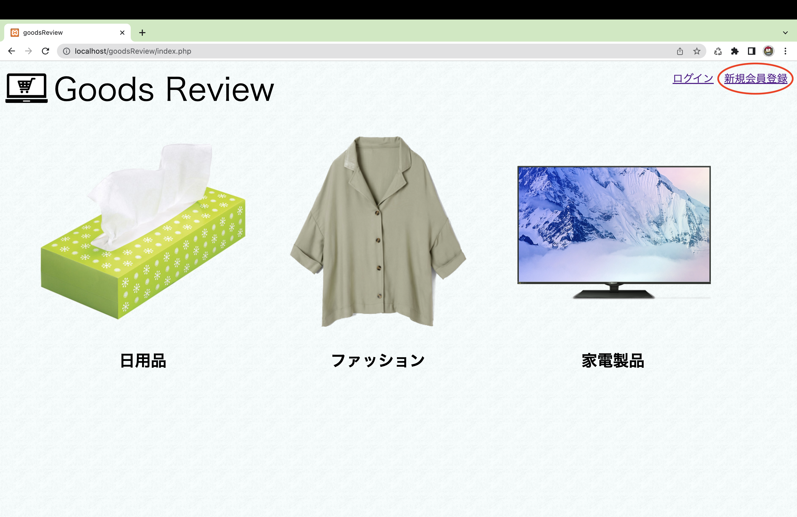
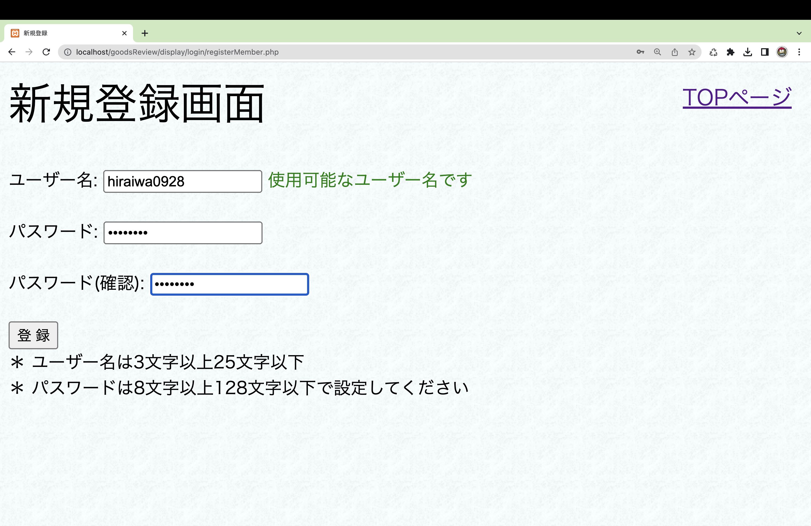
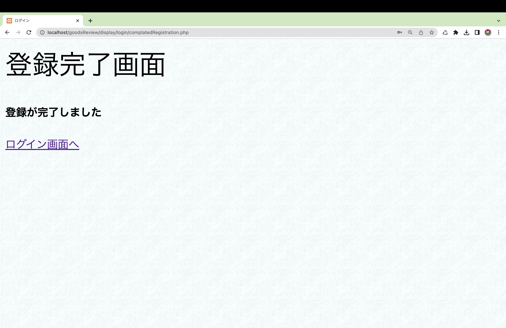
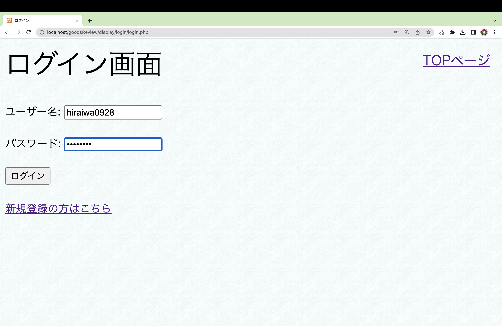
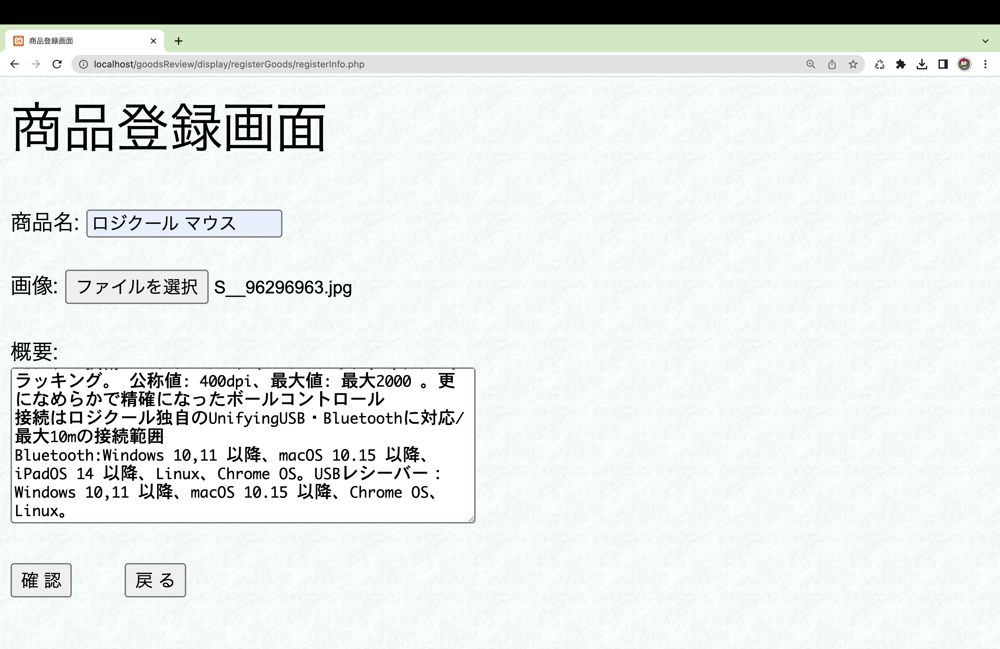
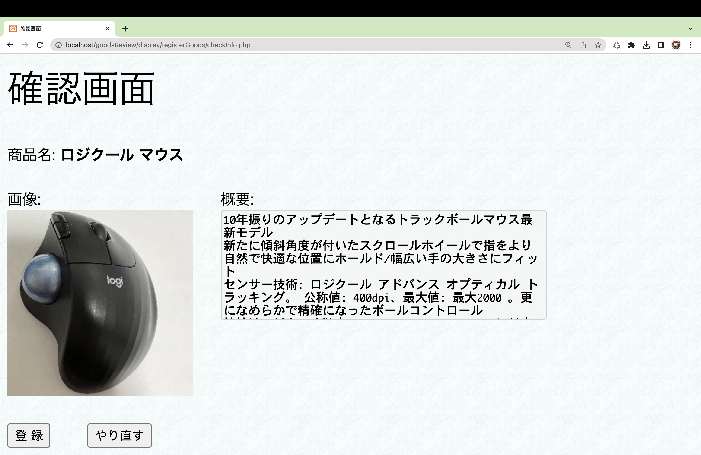
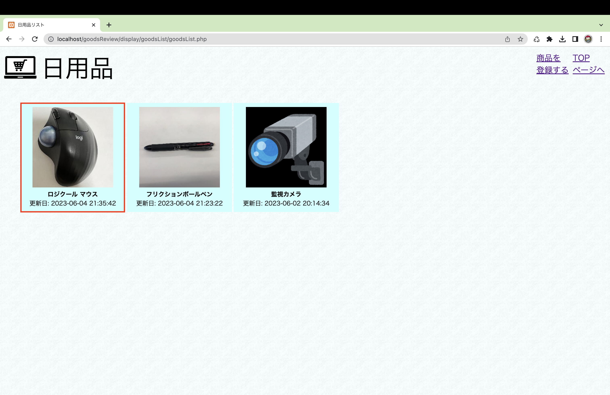

# GoodsReview

このWebアプリケーションは投稿された商品に対して様々なユーザーがレビューを書き評価します。レビューは星マークによって1〜5の評価と、文章による評価を投稿できます。そして、様々なユーザーからのレビューを一覧表示し、星による総合的な評価とレビュー文によって、商品の満足度や使いやすさなどを知ることができます。

# 使い方

## ログイン


GoodsReviewのTopページになります。<br>
このWebアプリケーションを使い際には、<strong>ログインが必要</strong>になります。<br>
会員登録をする際には、画面の右上の<strong>新規会員登録</strong>をクリックします。<br>

***

会員登録では<strong>ユーザー名</strong>と<strong>パスワード</strong>の入力が必要です。<br>
この際、すでに使用されているユーザー名は使用できません。<br>
また、パスワードの入力が間違っている際には登録ができません。<br>

***

入力内容が正しけば新規会員登録が完了します。<br>

***

会員登録した情報をログイン画面に入力します。<br>

***

Topページの右上にユーザー名が表示されたら、ログインが完了です。<br>
ログインが完了すると、<strong>商品の投稿</strong>と<strong>商品のレビュー</strong>ができるようになります。<br>

***

## 商品の登録について


Topページから<strong>日用品</strong>、<strong>ファッション</strong>、<strong>家電製品</strong>のジャンルを選択すると商品の一覧ページに遷移します。<br>
商品を登録する際には、商品一覧ページの右上の<strong>商品を登録する</strong>をクリックします。<br>

***

商品登録画面では、他のユーザーにレビューをして欲しい商品を登録します。<br>
商品の登録では、<strong>商品名</strong>、<strong>商品の画像</strong>、<strong>商品の概要</strong>を入力する必要があります。<br>

***

入力した商品の情報が表示されます。<br>
画面の表示された情報に不備がなければ、登録ボタンをクリックします。<br>

***

登録された商品は、商品一覧ページに表示されます。<br>
表示されている商品をクリックすることで、レビュー画面に遷移します。<br>

***

## 商品のレビューについて


商品の一覧画面から商品画像をクリックすると、その商品のレビューを確認することができます。<br>
自身がレビューを投稿する場合は、<strong>レビューを投稿する</strong>をクリックします。<br>

***

商品のレビューでは、<strong>星マークによる1〜5の評価</strong>と、<strong>文章による評価</strong>を行います。<br>

***

商品のレビューに関する内容を確認し、不備がなければ登録ボタンをクリックします。<br>

***

商品のレビューが完了すると、複数のユーザーの星マークによる評価が変化し、文章の評価が投稿されます。<br>
以上が、GoodsRevewの機能です。<br>

***


# 実行手順
<br>
1. root権限でユーザー名をusername、パスワードをpasswordとするユーザーを作成する。以下のSQL文を実行させる<br>

```
create user 'sample'@'localhost' identified by 'password';
```
<br>
2. root権限でcreateDatabase.sqlを発行し、goodsReviewというデータベースを作成する。<br><br>
3. root権限で作成したユーザーにgoodsReviewデータベースのアクセス許可を与える。以下のSQL文を実行させる<br>

```
grant all privileges ON goodsReview.*TO 'sample'@'localhost';
```
<br>
4. root権限を抜けて、ユーザー名sampleでログインをする。<br><br>
5. goodsReviewデータベースを選択し、member.sql、goods.sql、goodsReview.sqlの3つのファイルを実行させる。<br><br>
6. goodsReviewフォルダ内にある「./display/originalImages」、「./display/changeSizeImages」の二つのフォルダに権限を与えるために、カレントディレクトリをdisplayにした状態で以下のコマンドを入力してください。<br>

```
chmod 777 originalImages
chmod 777 changeSizeImages
```
<br>
7. DocumentRootにgoodsReviewフォルダを設置してください。<br><br>
8. http://localhost にアクセスするとTOPページが表示されます。
<br><br>
